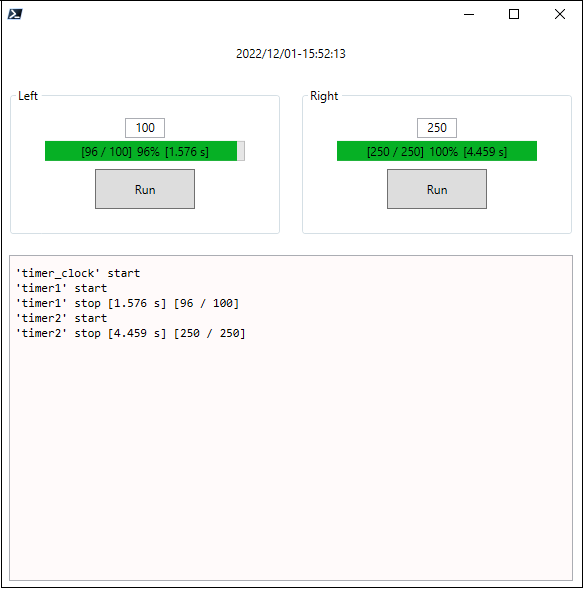

# DispatcherTimer Demo
DispatcherTimer demonstration in [PowerShell](https://en.wikipedia.org/wiki/PowerShell) with [WPF](https://en.wikipedia.org/wiki/Windows_Presentation_Foundation)

Three DispatcherTimers with clock, left and right panels which works together without freeze of GUI.

Only for demonstration of [PowerShell](https://en.wikipedia.org/wiki/PowerShell) capabilities with [WPF](https://en.wikipedia.org/wiki/Windows_Presentation_Foundation). 
